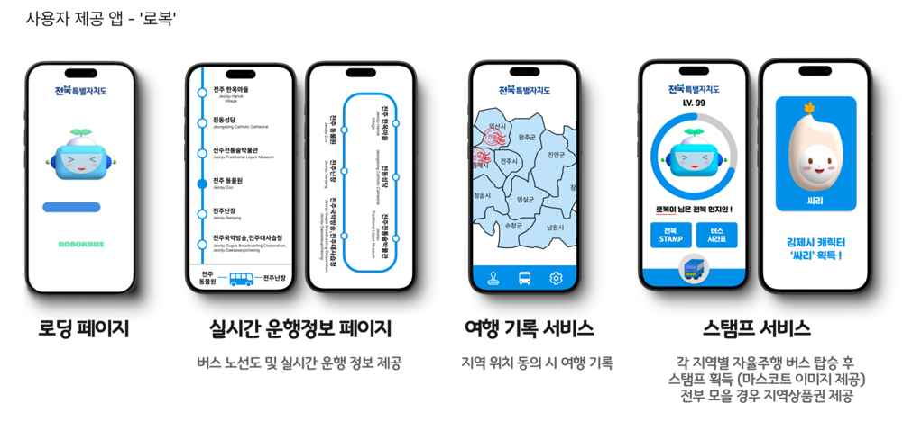

# 로복버스 (RobokBus)

**AI 자율주행 탐방버스 '로복버스' — 전북의 길을 따라**

<div align="center">
  
  <br><br>
  
</div>

---

> ⚠️ **안내**: 본 레포지토리는 팀원이 AI 분석 코드(analysis)와 웹 코드(robokbusWeb)를 통합한 레포지토리를 fork한 것입니다.
> 웹 프론트엔드(`web/`) 파트의 커밋 이력은 원본 레포지토리([na0young/robokbusWeb](https://github.com/na0young/robokbusWeb.git))에서 확인할 수 있으며, 기여자 `jga-eun`은 현재 계정(`gaeun-jay`)의 이전 계정입니다.

## 수상

**2024 전북특별자치도 스타트업 아이디어 공모전 장려상** (2024.11)

---

## 프로젝트 배경 및 목적

'모빌리티서비스' 과목을 통해 자율주행 기술에 관심이 생겼고, 전공 지식을 활용한 전북 지역 관광상품을 기획하기 위해 2024학년도 스타트업 아이디어 공모전(전북특별자치도)에 참여한 프로젝트입니다.

2024년 UROP 연구([InformRobot](https://github.com/gaeun-jay/InformRobot)에서 개발한 **DeepFace 기반 얼굴 인식 연령 분석 기술**을 자율주행 버스 플랫폼에 확장 적용하였습니다. 전주 지역 관광객을 대상으로 직접 사전 답사 및 설문조사를 수행하여 수요를 확인하고, AI 자율주행 버스와 모바일 플랫폼을 결합해 **사용자 맞춤형 정보 제공과 개인화된 관광 서비스**를 구현하는 것을 목표로 했습니다.

---

## 팀 구성 및 담당 역할

**개발 기간**: 2024.09 ~ 2024.11 (약 2개월) | **팀원**: 3명 (AI융합학부)

### 제가 담당한 주요 작업은 다음과 같습니다

| 구분 | 내용 |
| ---------- | --------------------------------------------------------------------------------------------------------- |
| **프론트엔드** | 웹 프론트엔드(`web/`) 전담 개발 (HTML, CSS, JavaScript) |
| **HW** | Fusion 360을 활용한 로복버스 3D 모델링 및 출력, 후가공 |
| **디자인** | Spline을 활용한 캐릭터 제작 / Figma를 활용한 UI 요소 디자인 / 버스 내 스크린 및 개인 스크린 UI 디자인 |

---

## 주요 기능

### SW — 자율주행버스 AI 기술

- **개인 스크린**: 카메라로 탑승자의 연령·성별·인종을 실시간 분석 (DeepFace)
- 분석 결과를 기반으로 글씨 크기·음성 속도 등 **맞춤형 정보 제공** (예: 65세 이상 → 글씨 크기 2배, 음성 속도 조절)

### HW — 3D 모델링

- Fusion 360을 활용한 로복버스 외관 및 내부 좌석 3D 모델링 직접 제작
- 출력 후 후가공 작업 진행

> 본 프로젝트는 아이디어 공모전 수준으로 구현된 것으로, 별도의 센서는 장착하지 않았습니다.

### 플랫폼

| 구분 | 내용 |
| ----------------------- | ------------------------------------------------------- |
| **모바일 앱 '로복'** | 버스 실시간 운행정보 페이지, 여행 기록 및 스탬프 서비스 |
| **버스 내 전체 스크린** | 버스 노선도 및 관광지별 정보 요약 |
| **버스 내 개인 스크린** | 연령 인식 기반 맞춤형 관광지 소개 |

---

## 사전 답사

**2024.10.09 — 전북 전주**

- 청년층을 위한 전주 여행 맞춤형 노선 기획
- 전주 지역 주민 및 관광객 대상 인터뷰·설문조사 수행 (총 51명)
  - 67%가 이동수단으로 버스 선택
  - 관광지로 가는 버스 수 부족 및 배차 간격 문제 확인
- 계획한 노선도에 따라 직접 답사 진행 (광화문 자율주행버스 사전 탑승)

---

## 기술 스택


| 구분 | 사용 기술 |
| ---------- | --------------------- |
| AI 분석 | DeepFace, OpenCV |
| 백엔드 | Python, Flask |
| 프론트엔드 | HTML, CSS, JavaScript |
| 3D 모델링 | Fusion 360, Spline |
| 디자인 | Figma |

---

## 미구현 기능

아이디어 공모전 수준으로 구현된 프로젝트로, 아래 기능은 추후 발전 방향으로 남겨두었습니다.

| 기능 | 설명 |
| ---------------------- | ------------------------------------------------------------- |
| **센서 기반 자율주행** | GPS, LiDAR, 초음파 센서 등을 실제 탑재하여 정밀 자율주행 구현 |

---

## 프로젝트 구조

```
Robok_Bus/
├── .gitignore
├── README.md
├── requirements.txt
├── analysis/
│   ├── .gitattributes
│   ├── app.py              # Flask 서버 (DeepFace 연령 분석)
│   ├── app.spec
│   ├── chat.html           # 분석 UI
│   ├── package-lock.json
│   └── package.json
└── web/
    ├── bustime.html        # 버스 시간표
    ├── home.html           # 메인 홈
    ├── loading.html        # 로딩 페이지
    ├── loop-local.html     # 노선 지역 정보
    ├── loop-time.html      # 노선 시간 정보
    ├── stampMap.html       # 스탬프 지도
    ├── totalcharacter.html # 전체 캐릭터
    ├── assets/
    │   ├── bus.png
    │   ├── robok.png
    │   ├── ssari.png
    │   ├── ssari2.png
    │   ├── stamp.png
    │   ├── map.png / map2.png
    │   └── fonts/
    │       └── JalnanOTF.otf
    ├── css/
    │   ├── base.css
    │   ├── bustime.css
    │   ├── home.css
    │   ├── loading.css
    │   ├── loop-local.css
    │   ├── loop-time.css
    │   ├── stampMap.css
    │   └── totalcharacter.css
    └── js/
        ├── bustime.js
        ├── home.js
        ├── loading.js
        └── loop-local.js
```

### API 엔드포인트

| 엔드포인트 | 설명 |
| ---------------- | ------------------------------------------------------------ |
| `/video_feed` | 웹캠 스트리밍 + 연령·성별·인종 실시간 표시 |
| `/analyze_frame` | 프론트엔드에서 이미지 POST 수신 → DeepFace 분석 후 JSON 반환 |

---

## 설치 및 실행

### 사전 요구사항

- Python 3.8 이상
- 웹캠

### 실행 방법

```bash
# 1. 레포지토리 클론
git clone <repository-url>
cd robokbus/analysis

# 2. 패키지 설치
pip install -r requirements.txt

# 3. .env 파일 생성
# OPENAI_API_KEY= 본인의 API키 입력

# 4. 실행
python app.py
```

브라우저에서 `http://localhost:5000` 접속

> `.env` 파일에 API 키가 없으면 일부 기능이 동작하지 않을 수 있습니다.
